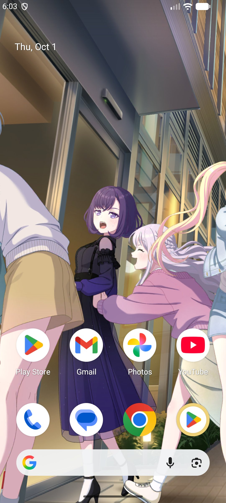
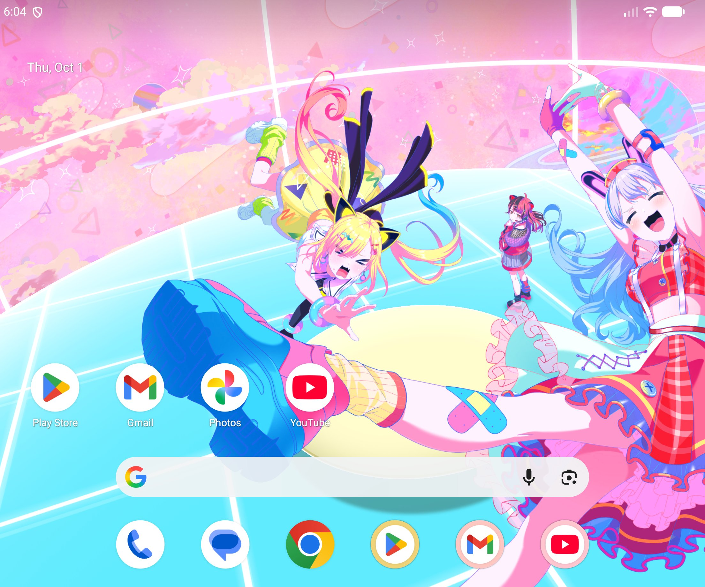

BanG Dream! Our Notes의 이머시브 홈을 macOS, Windows, Android에서도 만나보세요!
# 설치법
## macOS
1. 최신 릴리즈에서 `BDONImmersiveHome.dmg` 파일을 다운로드합니다.
2. DMG 파일을 열고 BDON Immersive Home 앱의 아이콘을 Applications 폴더로 드래그하여 복사합니다.
3. readme.txt 파일을 열고 텍스트 파일 내의 명령어를 터미널에 입력하여 앱을 격리 해제합니다.
4. Spotlight 또는 Applications 폴더에서 BDON Immersive Home 앱을 실행합니다.
5. 상단 민물고 아이콘을 통해 각종 설정을 진행할 수 있습니다.
## Windows 
1. 최신 릴리즈에서 PC의 아키텍처에 따라 파일을 다운로드합니다.
    - 일반 PC(Intel/AMD): `BDONImmersiveHome-win-x64.zip`
    - ARM PC(Snapdragon 등): `BDONImmersiveHome-win-arm64.zip`
2. zip 파일을 원하는 위치에 압축 해제합니다.
3. 압축을 푼 폴더에서 `BDONImmersiveHome.exe`를 실행합니다.
    - "Windows의 PC 보호" 창이 뜨면 **추가 정보** → **실행**을 누릅니다.
4. 설치 여부를 묻는 창에서 **예**를 누르면 설치가 완료되고 앱이 실행됩니다.
    - 시작 메뉴 등록과 Windows 시작 시 자동 실행이 함께 설정됩니다.
    - **아니요**를 누르면 설치하지 않고 해당 폴더에서 바로 실행합니다.
5. 작업 표시줄 트레이 아이콘을 통해 각종 설정을 진행할 수 있습니다.
    - 아이콘이 보이지 않으면 작업 표시줄의 **^**(숨겨진 아이콘)를 누르거나, 설정 > 개인 설정 > 작업 표시줄 > 기타 시스템 트레이 아이콘에서 켭니다.
## Android
1. [Releases](https://github.com/tomo-taki/bdon-immersive-home/releases)에서 `BDONImmersiveHome-android.apk` 파일을 다운로드합니다.
    - Android용 수정만 담긴 릴리즈는 Latest로 표시되지 않으므로, 목록에서 APK가 들어 있는 가장 위의 릴리즈를 받습니다.
2. 내려받은 APK를 열어 설치합니다.
    - "출처를 알 수 없는 앱" 설치를 허용할지 묻는 창이 뜨면, APK를 연 앱(브라우저, 파일 관리자 등)에 허용합니다.
3. 앱 목록에서 BDON Immersive Home을 실행합니다.
    - 처음 실행할 때와 업데이트 직후에는 장면 데이터를 준비하느라 몇 초 걸립니다.
4. 장면을 고른 뒤 **배경화면으로 설정**을 누르고, 미리보기 화면에서 배경화면을 설정합니다.
    - 홈 화면, 잠금 화면, 또는 둘 다에 적용할 수 있습니다.
5. 앱에서 캐릭터 표시, 스와이프로 시점 이동, 장면 셔플(시간마다 / 화면을 켤 때마다)을 설정할 수 있습니다.
# 권장 사양
| 항목    | macOS                        | Windows x64 (Intel/AMD)       | Windows arm64 (Snapdragon 등) | Android                  |
| ----- | ---------------------------- | ----------------------------- | ---------------------------- | ------------------------ |
| OS    | macOS 15 Sequoia 이상          | Windows 11                    | Windows 11                   | Android 8.0 이상           |
| 칩     | Apple Silicon (M1 이상)        | 64비트 Intel / AMD CPU          | Snapdragon 등 ARM64 CPU       | 64비트 ARM (arm64-v8a)     |
| 그래픽   | Apple Silicon 내장 GPU (Metal) | DirectX 11 지원 GPU (내장 그래픽 포함) | DirectX 11 지원 GPU            | OpenGL ES 3.0 지원 GPU     |
| 메모리   | 8GB 이상                       | 8GB 이상                        | 8GB 이상                       | 6GB 이상                   |
| 저장 공간 | 1GB 이상                       | 1GB 이상                        | 1GB 이상                       | 1GB 이상                   |
Intel Mac, 32비트 및 x86 Android 기기는 지원하지 않습니다.
# 업데이트
다음과 같은 경우에 업데이트가 배포됩니다.

1. 버그 수정
2. BanG Dream! Our Notes에 새로운 이머시브 홈 추가

macOS와 Windows 앱은 실행 후 15초 뒤, 그리고 이후 하루에 한 번 새 버전이 있는지 확인합니다. 새 버전이 있으면 **설정 > 정보**에서 업데이트 내용을 확인한 뒤 **업데이트 설치** 버튼을 눌러 적용합니다. 앱이 파일을 내려받고 검증한 뒤 교체와 재실행까지 알아서 진행하므로, 처음 설치한 이후에는 GitHub에 직접 접속하지 않아도 됩니다.

특정 OS에서만 생긴 문제는 그 OS용 업데이트만 배포될 수 있습니다. 이때 다른 OS의 앱에는 업데이트가 표시되지 않습니다.

Android 앱은 자동 업데이트를 지원하지 않습니다. 새 APK를 내려받아 기존 앱 위에 설치하면 설정은 그대로 유지됩니다.

업데이트 파일은 이 저장소의 [Releases](https://github.com/tomo-taki/bdon-immersive-home/releases)에서만 내려받습니다. 내려받은 파일은 릴리스에 함께 올라간 SHA-256 체크섬으로 확인하며, 값이 다르면 설치하지 않습니다. 업데이트 확인과 다운로드 외에는 앱이 인터넷에 접속하지 않습니다.
# 앱의 제거
## Mac
앱을 종료하고 Applications 폴더에서 앱을 휴지통으로 드래그하여 제거할 수 있습니다.
## Windows
설정 > 앱 > 설치된 앱에서 제거할 수 있습니다.
## Android
앱 아이콘을 길게 눌러 제거하거나, 설정 > 애플리케이션에서 BDON Immersive Home을 제거할 수 있습니다.
# 스크린샷

## Android

  
  

